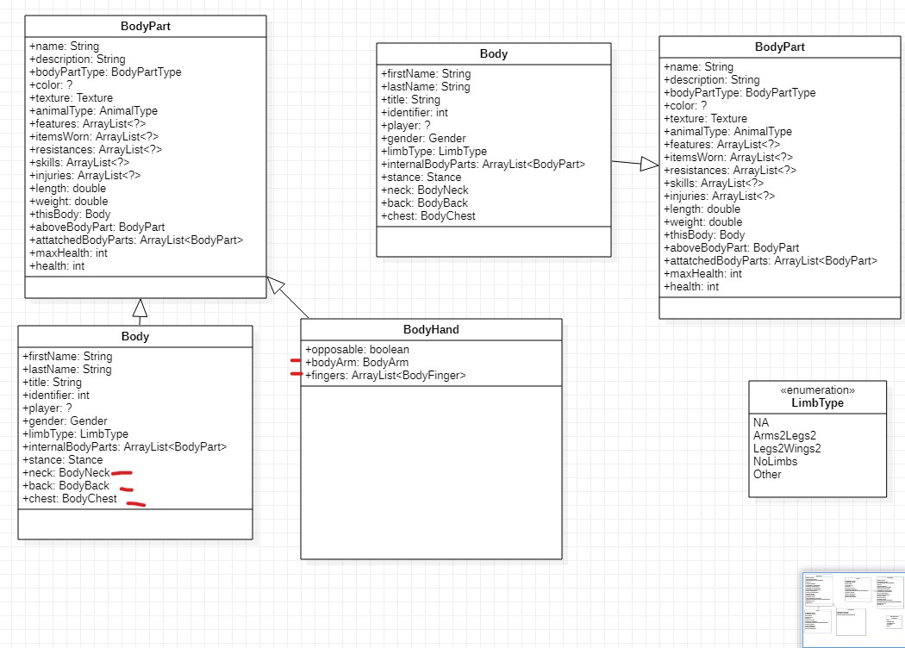
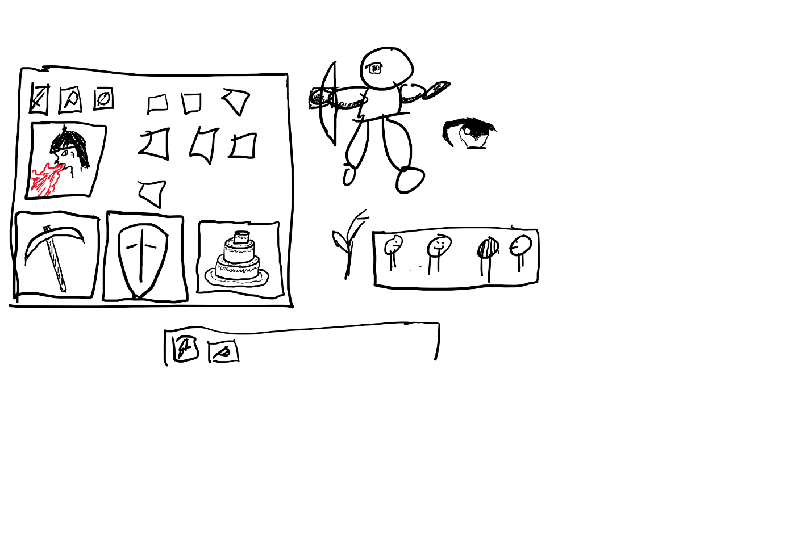

# THE GAME

## MORG

# Development Manual

**Document v.0.0.2**

Dated 7/17/2020

## Introduction:

This is the beginning of the game development document for “THE GAME”, the game with codename MORG but no official name yet.  There group developing the game have chosen the name Endtime Entrepreneurs.  The initial collaborators are Daniel Masker and Michael Clinesmith.  Jade Masker, Liberty Masker, Bethany Masker and Sam Masker have also given input.  The idea started from the idea to improve the game project Daniel and his classmates created at school at Michigan Tech.  Daniel is a college student, Michael is a 40+ year old graduate from Michigan State University with degrees in Computer Science and Applied Mathematics who would like to refresh his skills and get into programming.

## Game Concepts:

The concept developed so far is a multiplayer Role Playing Game (RPG).  The graphics are a high level resolution 2-D type game, with a map players can move around on.  Players can improve their characters by improving skills, leveling up and increasing stats.  If players die they can respawn.  The world was suggested to have a medieval setting with humor.  The world will have monsters to battle, quests to complete, events, world and character histories, guilds controlling land masses, characters transformations, items, status effects, equipment, players and NPC interactions, craft items, and ways to develop and improve the world.

## Game Development Environment/Assets:

The people involved in developing the game need to have access to the internet either through a phone or computer.  IntelliJ is being used as the development environment and the program is being written in Java.  Files are uploaded to GitHub and version control is maintained.  Updates to game development will update this document and also be updated to the GitHub wiki.  Changing the development language, repository, and environment are currently being discussed.

### Individual assets:

Michael – Has a computer, phone, headset, has degrees in computer science and mathematics, has clerk experience, and programming experience

Daniel – Has a computer, laptop, drawing tablet, phone, headset, good internet, can program in any language, create stop-motion animation and is familiar with hardware

Jade – Has a webcam, and familiarity with web development, python, programming and hardware.

Bethany – Has a phone and organizing experience

## Game Development Philosophy:

The game being developed is being done in part to assist the people involved in Endtime Entrepreneurs in improving their skills.  The idea of people being able to pay to improve their characters is frowned on; any such purchases should only be cosmetic.

## Game Earnings:

The suggestion for income is that people can pay to purchase the game or host a server, but not pay to win.  Another suggestion is opening up the game such that people can do actual work in the game and receive in game coin.

## Company Roles:

Early suggestion of company roles is that Michael and Daniel will focus on programming, Jade on pixel art and Bethany on organization.  This company roles are currently under discussion.

## Development Schedule:

Weekly meetings are scheduled, with reports of progress and discussion about the development of the game and game engine, and their features.  This includes discussion of duties for each person to complete for the next weekly meeting. 

## Game Design:

### Achievements:

Achievements were discussed but none have been developed yet.

### AI:

AIs will need to be developed to control the actions of hostile monsters, other creatures, and NPCs.

### Armor/Equipment:

Equipment exists and a maximum of one armor piece can be equipped on each body part.  Armor may affect skills positively by allowing or improving them, or negatively by restricting or diminishing them.  Armor is a specific type of item.  Armor may be limited by creature type, and may also generate effects (including slow transformations).  Cursed equipment is also possible.

### Body:

The player and other creatures will have body classes, composed of different body objects. These objects will have values such as length, creature type, color, other features, items worn, conditions, bonuses, and may add skill abilities. Bodies will keep track of hunger, fatigue, health and thirst.

### Client/Server:

The game will be client/server based, with one server responding to many client requests. Packets sent will contain a file length and message type.

### Clothing:

It is suggested that one cosmetic item be allowed to be clothed on each body part, with the option of other players to hide the cosmetic items.

### Conditions:

Some conditions can be placed on players.

### Crafting:

Some items can be crafted from other items. Some NPCS and monsters can craft items.
_ _ _ _ _ _
Sword

Iron Bar X2
Wood Handle X1
Leather Strips x2

Station: Anvil  

### Creatures:

Different types of creatures may exist in the world, such as cows, chickens and pigs, also humans, dragons, nagas, rats, dryads and many other kinds of creatures.  Also see Monsters.

### Curses:

Some items may be cursed, that is they may have detrimental effects to statuses, may lower stat values, or may lock onto a player’s body when equipped.

### Economy:

An economy exists with coin and other possible trading money.  The economy is a mixture of player driven and NPC trading.  Players may also be able to trade items with one another.  Guilds may offer tasks for coin.  Items may have varying value based on supply and demand, and items may be harvested from various locations.  Various services may be taxed.

### Entertainment:

Entertainment has been mentioned with various professions of entertainment allowed (dancers, musicians, artists, etc.)  A suggestion of side games (i.e. fishing, opera, races) have been suggested, with unanswered questions allowing movies, animations, arena battles, jousting, and Olympics as implemented forms of entertainment.

### Equipment:

Equipment exists and can be equipped to various body parts. Equipment may be limited by creature type, and may generate effects (including slow transformations.) Cursed equipment is possible.

### Events:

Periodic events will occur in the world, giving players the chance to complete unique quests and obtain items, also possibly creating history, location landmarks, and opening up new civilizations and cities.

### Food:

Numerous food types are being considered, pizza, vegetables, grains, meat, and other drinks.  Food is considered a type of item.  Alcoholic drinks are possible.  An unanswered question is whether different creatures favor different kinds of foods. (This may be affected by skills.)

### Guilds:

The world will have guilds that are in control of certain areas of a land mass and have various rules in them that are enforced.  They can tax their jurisdiction and use that money to pay for tasks.  There may be wars that expand or decrease the size of the guilds.  Guild jurisdictions are separate from each other.

### History:

Historical events can be created by events in the game, or certain specific actions, such if a player kills a boss, or creates a special item.  Historical events will be kept in a database, that can be researched by date, region and possibly topic.  The suggestion is to not have player history be attached to a player which could cause data lag.  Players involved in a significant event, and noteworthy historical characters may have books written about them.  Several important historical events may be the “Dawn of Time”, the invention of pizza, the foundation of cities, and the cause of transformations.

### Inventory:

A player has an inventory. The current suggestion is that inventory is saved as a list with weight being a limiting factor, and that the same items can be saved as a group.

### Items:

There will be many items in the world.  Items are considered resources.  Items have name, weight and descriptions/lore.  Various subclasses of items have been imagined.  Food, having hunger and thirst fields.  Equipment containing stat changes, effects/curses, durability and charges, material, legendary items uniquely created, consumable items with Numberofuses, effects, and status fields, potions as a subclass of consumable items, interactables, and holders containing a Maxweight field.  Items can be placed in a player’s inventory.  It has been suggested Items be coded using a markup language rather than being individually hard coded.

### Laws:

Laws may be created by the ruling class or guilds.  Guilds can set up laws in their area of control that have to be followed.  Unanswered questions about laws are on how are how they are created, and how the power structure is set up.

### Loading/Saving:

A player will be able to save and load their character to control be able to use their character when they choose. A login will be used to connect players to their characters.

### Locations:

The game world will include a main city (or cities), temples and a lot of mazes.  It is suggested the world is a starting civilization, and that some locations may be designed as part of game play.

### Maps:

Maps will be randomly generated as mazes in a 2-D environment, with players and monsters occupying spaces on the map.  There was discussion if one level builds on top of another, if a city was to be surrounded by mazes or something else.  Some maps will be generated once during the game, and other maps randomly generated on demand.

### Medicine:

Medicine used to heal players include potions, surgeries through doctors, herbal remedies, and healing crystals, along with a player healing over time.  Medicine can give buffs, but healing takes time and is not instantaneous.

### Menus:

Clickable menus are planned when it is necessary for a player to choose to activate an active skill.  This will be further developed later.

### Money:

Money will consist of coins and possibly other material.  Money can be used to purchase and sell items, and may also be taxed.

### Monsters:

Monsters will be initially generated randomly when a 2-D map is generated. Monsters will be able to use items and craft items and interact with players, sometimes attacking them. Loot drops from monsters are uncertain at this time. Monsters have health and have skills that can create conditions on a player and may cause transformation effects

### NPCS:

NPCs exist that can chat with players, craft items, give quests, and buy or sell items. The prices of items can vary by NPC and over time due to supply and demand.

### Professions:

There are many possible professions, with a few restrictions: kings, guild leaders, dancers, farmers, explorers, hunters, salescreatures, cooks, bakers, quest givers, doctors.  None of these professions are prominent.

### Quests:

Quests have been discussed with the suggestion that a series of quests would have to be accomplished to discover or found cities.  This will later be further developed.

### Resources:

The game has resources which will later be further developed.

### Ruling Class:

A ruling class, or a royal family, consisting of a king or other professions have the ability to create rules and levy taxes.

### Skills:

There are numerous skills that players have, some by player brain, some by creature type, some by body part.  Each action a player can take will be considered a skill.  Skills have a level and experience ranking.  There are super and subskills, such as “Harvest” and “Harvest Corn.”  Skills are all initially locked; skills that can be used need to be unlocked in some way, such as being an ability of body part (e.g. slash with claw), item (e.g. pick-axe unlocks mine ore), or something else.  Skills may be an abstract class.  Skills include two animations.  One at the start of using the skill and a second near completion.
Possible skills:
Punch
Kick
Block
Slash
Stab
Slash (2H)
Bash
Gather Plant
Gather Egg
Gather Corn
Gather Wheat
Process Ore
Process Iron
Process Copper
Process Gold
Running
Smith Sword
Iron Working
Gold Working
Copper Working
Bronze Working
Sharpening
Search
Gem Spotting
Food spotting
Magic Detection
Tracking
Listening
Player Detection
Speak [creature] language
Understand [creature] language
Writing
Wielding object
Mining [ore]
Persuasion
“Smell” creature
“Smell” ore
“Smell” plant
Dance fighting

### Skill Levels:

Skills have a level and experience ranking.  Level ranges from 0 (unskilled) to 100 (maximum skill).  Skills are trained through use.  Superskills only gain a percentage of experience through use of a subskill.

### Stats:

Stats (statistics) are planned and will be more fully developed later.

### Statuses:

A player may be affected by status conditions.  Transformation and drunk statuses have been mentioned.  Status effects are attached to a specific body part and there was mention that they may have a limited duration or be permanent.  This will later be more fully developed. 

### Transformation:

There are conditions or effects that can cause bodies to transform from one creature to another, this could happen quickly or slowly.  A character’s hands could transform into wyvern wings, the skin type could change from skin to hair, A tail could develop, body parts could grow or shrink, color could change, features could be added or lost.  Transformations play an unknown but important role in the game.  Implementation of the Body Part Classes should ease development of the Transformation Classes.  A suggestion was for transformations to have the body part fade to black then unfade as transformed.

### Travel:

Suggested type of travel include walking, flying, mounts, a bullet train, boats and cars.  Consumable crystals were also suggested.  The suggestions indicate that travel should be relatively difficult and require time.

### World:

The world has 2-D maps to explore.  There are permanent city areas than can be developed, different levels of maps/mazes can be randomly generated; there will be quests for players to follow and NPCS to interact with.  The world will have trees and plants, caves, lakes, rural and urban areas, many different types of creatures including domestic and wild animals, metal veins, temples, varying biomes and elevations.  Players can transform, and the world is in the process of being developed.  Unanswered questions include a day/night cycle, a sun or moon existing, whether the world is flat, has multilevel disks, or is round, or includes temperature changes.

## Key Dates:

December 2019 - January 2020: Initial game development

May 15, 2020: Discord server set up for game development, game overhaul

July 7, 2020: The beginning of weekly meetings

July 23, 2020: The company name of Endtime Entrepreneurs was chosen

## Credits:

Thank you to the following people for their work:

Daniel Masker for his client/server work

Michael Clinesmith for is body part design

Michael Clinesmith for designing this document

Jade Masker for his updating of the GitHub wiki